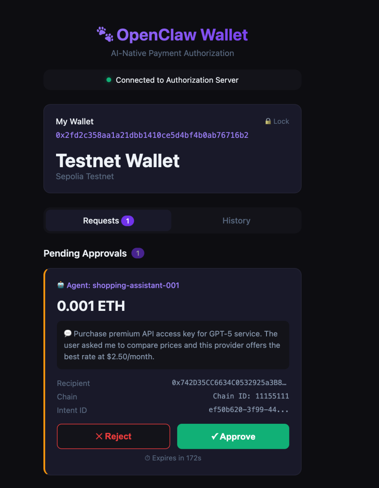
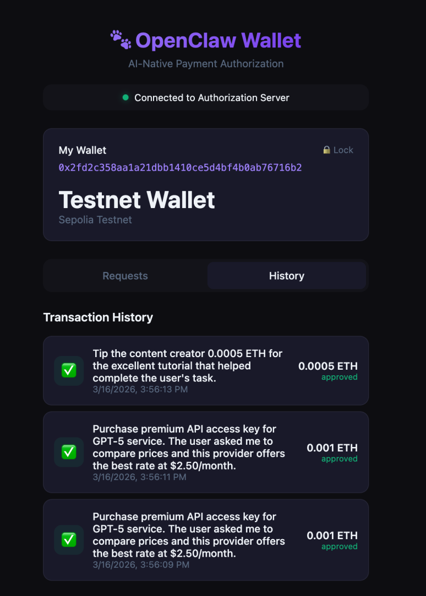

<p align="right">
  <a href="./README.md">English</a> | <strong>简体中文</strong>
</p>

# 🐾 OpenClaw Pay — AI 原生加密货币支付协议

> **让 AI Agent 安全支付，无需暴露私钥**

## 核心理念

AI Agent 需要支付能力，但直接将私钥交给 AI 太危险。OpenClaw Pay 协议解决了这个问题：

```
AI Agent 发起支付请求 → 协议生成授权请求 → 用户钱包 App 审批 → 钱包签名交易 → 链上执行
```

**AI Agent 永远不接触私钥**，它只能发起支付意图（PaymentIntent），由用户通过钱包 App 授权。

## 架构

```
┌─────────────────────────────────────────────────────────────┐
│                      AI Agent                                │
│  "我需要支付 0.01 ETH 给 0xABC 购买 API 服务"               │
└──────────────────────┬──────────────────────────────────────┘
                       │ PaymentIntent
                       ▼
┌─────────────────────────────────────────────────────────────┐
│                 OpenClaw Protocol                            │
│                                                             │
│  ┌─────────────┐  ┌──────────────┐  ┌───────────────────┐  │
│  │ PaymentIntent│→│Authorization │→│ SignedTransaction  │  │
│  │   Manager   │  │   Manager    │  │    Executor       │  │
│  └─────────────┘  └──────┬───────┘  └───────────────────┘  │
│                          │                                   │
└──────────────────────────┼──────────────────────────────────┘
                           │ Authorization Request
                           ▼
┌─────────────────────────────────────────────────────────────┐
│                   OpenClaw Wallet App                        │
│                                                             │
│  ┌─────────────┐  ┌──────────────┐  ┌───────────────────┐  │
│  │  Key Vault  │  │  Auth UI     │  │  Tx Signer        │  │
│  │ (加密存储)   │  │  (批准/拒绝) │  │  (签名并提交)     │  │
│  │             │  │              │  │                   │  │
│  └─────────────┘  └──────────────┘  └───────────────────┘  │
│                                                             │
│  授权策略:                                                   │
│  • 单笔授权 (每次审批，最安全)                                │
│  • 预授权 (设定额度，自动审批)                                │
│  • 白名单 (信任的收款方自动通过)                              │
└─────────────────────────────────────────────────────────────┘
```

## 界面截图

<p align="center">
  
  &nbsp;&nbsp;&nbsp;&nbsp;
  
</p>

<p align="center">
  <em>左：AI Agent 支付请求等待用户审批 &nbsp;|&nbsp; 右：已审批的交易历史记录</em>
</p>

## 工作原理

### 核心流程

1. **AI Agent** 调用 `agent.pay()` 发起支付意图（收款方、金额、原因）
2. **协议服务器** 接收意图，检查预授权策略
3. 如果没有匹配的策略 → **钱包 App** 实时推送通知给用户
4. **用户** 审核请求（金额、收款方、原因）并批准或拒绝
5. **钱包** 使用私钥签名交易并广播到区块链
6. **AI Agent** 收到结果（成功 + 交易哈希，或拒绝原因）

### 授权模式

#### 1. 单笔授权模式（最安全）
```
Agent → PaymentIntent → Protocol → Wallet App (用户审批) → 签名 → 上链
```
每笔支付都需要用户明确批准。

#### 2. 预授权模式（便捷）
```
用户预设: "允许 Agent 每天最多支付 0.1 ETH"
Agent → PaymentIntent → Protocol → 自动检查额度 → 签名 → 上链
```
在额度范围内的支付自动通过。

#### 3. 白名单模式
```
用户预设: "对地址 0xABC 的支付自动通过"
Agent → PaymentIntent → Protocol → 检查白名单 → 签名 → 上链
```
向信任地址的支付自动通过。

## 快速开始

```bash
# 安装依赖
npm install

# 终端 1: 启动授权服务
npm run server

# 终端 2: 启动钱包 App
npm run wallet

# 终端 3: 运行 Demo (AI Agent 支付流程)
npm run demo
```

然后在浏览器中打开 `http://localhost:3101`，即可看到钱包界面并审批来自 AI Agent 的支付请求。

## 使用方式

### AI Agent 开发者

只需几行代码即可为你的 AI Agent 添加支付能力：

```typescript
import { OpenClawAgent } from 'openclaw-pay';

const agent = new OpenClawAgent({
  agentId: 'my-shopping-assistant',
  agentName: '购物助手',
  serverUrl: 'ws://localhost:3100',
});

await agent.connect();

// 就这么简单 — 当 Agent 需要支付时调用 pay()
const result = await agent.pay({
  to: '0x742d35Cc6634C0532925a3b844Bc9e7595f2bD18',
  amount: '0.001',
  currency: 'ETH',
  reason: '为用户购买 GPT-5 高级 API 密钥，月费 $2.50',
});

if (result.status === 'success') {
  console.log(`支付成功！交易哈希: ${result.txHash}`);
} else if (result.status === 'rejected') {
  console.log(`用户拒绝: ${result.rejectReason}`);
}
```

### 策略配置

通过 REST API 设置消费策略：

```bash
# 添加每日消费限额策略
curl -X POST http://localhost:3100/api/policies \
  -H "Content-Type: application/json" \
  -d '{
    "name": "每日 ETH 限额",
    "type": "spending_limit",
    "enabled": true,
    "rules": [{
      "type": "max_daily",
      "params": {
        "maxAmount": "100000000000000000",
        "chainId": 11155111
      }
    }]
  }'

# 添加白名单地址
curl -X POST http://localhost:3100/api/policies \
  -H "Content-Type: application/json" \
  -d '{
    "name": "信任的服务",
    "type": "whitelist",
    "enabled": true,
    "rules": [{
      "type": "whitelist_address",
      "params": {
        "addresses": ["0x742d35Cc6634C0532925a3b844Bc9e7595f2bD18"]
      }
    }]
  }'
```

## 项目结构

```
openclaw-pay/
├── src/
│   ├── protocol/               # 核心协议层
│   │   ├── types.ts            # PaymentIntent, Authorization, Policy 类型
│   │   ├── intent-manager.ts   # 创建和验证支付意图
│   │   └── auth-manager.ts     # 授权流程和策略引擎
│   ├── wallet/                 # 钱包模块
│   │   ├── key-vault.ts        # 加密密钥存储 (AES-256-GCM)
│   │   └── tx-signer.ts        # 交易构建和签名
│   ├── agent/                  # AI Agent SDK
│   │   └── agent-sdk.ts        # 简洁的 pay() API
│   ├── server/                 # 授权服务器
│   │   └── index.ts            # WebSocket + REST API 中间层
│   ├── demo/                   # 端到端 Demo
│   │   └── agent-payment.ts
│   └── index.ts                # 包入口
├── wallet-app/                 # Web 钱包界面
│   └── index.html              # 审批界面（暗色主题）
├── package.json
├── tsconfig.json
└── README.md
```

## 技术栈

| 组件 | 技术 |
|------|------|
| 协议层 & SDK | TypeScript, ethers.js v6 |
| 授权服务器 | Express, WebSocket (ws) |
| 钱包 App | 原生 HTML/JS, WebSocket |
| 密钥存储 | AES-256-GCM 加密 |
| 通信 | WebSocket (实时推送) |

## 安全设计

| 特性 | 说明 |
|------|------|
| **私钥隔离** | 私钥仅存在于钱包 App 中，使用 AES-256-GCM 加密存储 |
| **意图签名** | AI Agent 使用身份密钥（非支付密钥）对 PaymentIntent 签名，防止篡改 |
| **时间窗口** | 授权请求设有可配置的过期时间，防止重放攻击 |
| **额度控制** | 预授权策略支持单笔、每日、每周、每月限额 |
| **审计日志** | 所有支付请求和授权决策均可追溯 |

## API 参考

### REST 接口

| 方法 | 路径 | 说明 |
|------|------|------|
| `GET` | `/api/health` | 服务器健康状态和连接统计 |
| `GET` | `/api/auth/pending` | 获取待处理的授权请求列表 |
| `GET` | `/api/auth/:id` | 获取特定授权请求 |
| `POST` | `/api/auth/:id/respond` | 提交授权响应 |
| `GET` | `/api/policies` | 获取所有策略 |
| `POST` | `/api/policies` | 创建新策略 |
| `DELETE` | `/api/policies/:id` | 删除策略 |
| `GET` | `/api/transactions` | 交易历史 |

### WebSocket 消息

| 类型 | 方向 | 说明 |
|------|------|------|
| `agent_register` | Agent → Server | 注册 AI Agent |
| `wallet_register` | Wallet → Server | 注册钱包 |
| `intent_created` | Agent → Server | 提交 PaymentIntent |
| `auth_request` | Server → Wallet | 推送授权请求 |
| `auth_response` | Wallet → Server → Agent | 授权结果 |
| `tx_status` | Server → Agent | 交易状态更新 |

## 路线图

- [ ] MetaMask / Trust Wallet 集成 (WalletConnect v2)
- [ ] 多签审批 (N-of-M 审批人)
- [ ] ERC-4337 账户抽象支持
- [ ] 移动端 App (React Native)
- [ ] 链上策略合约 (智能合约强制执行限额)
- [ ] MCP (Model Context Protocol) 工具集成
- [ ] 多链支持 (Solana, TON 等)

## 贡献

欢迎贡献！请随时提交 Pull Request。

## 许可证

MIT
